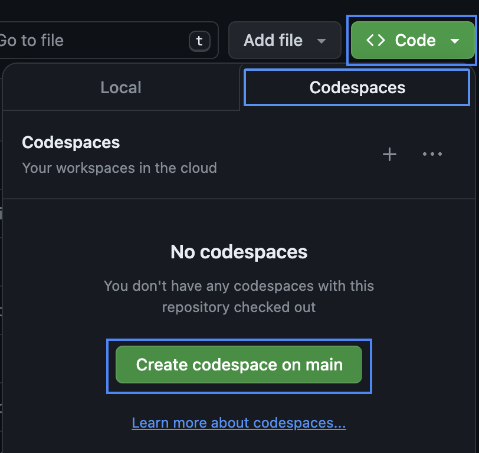

# Cloud Native Geospatial Earth Observation Workshop

This repository contains workshop materials to that introduce
cloud native methods of working with Earth observation data products.

The repository focusses on the use case of measuring land productivity 
as a subindicator of Sustainable Development Goal indicator 15.3.1: 
Proportion of land that is degraded over total land area. For more infromation
please see the [Satellite Data Requirements for SDGIndicator 15.3.1](https://ceos.org/sdg/files/supportsheets/SDG_15.3.1_EO_Satellite_Data_Requirements_31Aug2022.pdf).

## Quickstart

### Start the Codespace

The easiest way to get started running through this workshop is to
launch a GitHub Codespace, which includes a VS Code web environment that
includes the ability to run and edit Jupyter Notebooks.

1. Click the green Code button
2. Click the Codespaces tab
3. Click Create codespace on main



### Sign into NASA's Earthdata portal and create an access token

Sign up for EarthData: https://urs.earthdata.nasa.gov/

1. Log in to EarthData
2. Go to the Generate Token tab
3. Click the green generate token button
4. Copy the token to your clipboard

### Add the access token to secrets.json

In the Codespace:

1. Rename `secrets.json.sample` to `secrets.json`
2. Paste your token inside the quotation marks

```
{
   "earthdata": {
       "token": "your-token-here"
   }
}
```

### Run the demonstration notebook

Open the `Cloud_Native_Land_Productivity_For_SDG15.ipynb` 
notebook and work through the cells.

## Authorship and sponsorship

This notebook was written by Alex Leith and Caitlin Adams, who were funded by the Committee on Earth Observation Satellites.
